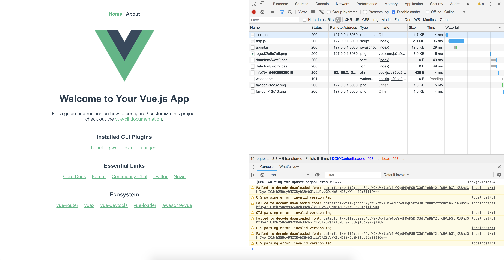

# `vue_js_inline_fonts_bug`
`vue_js_inline_fonts_bug` demonstrates an issue with inlining `woff2` font files in `Vue CLI 3`.

## issue
### log
```sh
[HMR] Waiting for update signal from WDS...
localhost/:1 Failed to decode downloaded font: data:font/woff2;base64,bW9kdWxlLmV4cG9ydHMgPSBfX3dlYnBhY2tfcHVibGljX3BhdGhfXyArICJmb250cy9NZXRyb3BvbGlzLUJvbGQuNmE4MDEyNWUud29mZjIiOw==
localhost/:1 OTS parsing error: invalid version tag
localhost/:1 Failed to decode downloaded font: data:font/woff2;base64,bW9kdWxlLmV4cG9ydHMgPSBfX3dlYnBhY2tfcHVibGljX3BhdGhfXyArICJmb250cy9NZXRyb3BvbGlzLUJvbGQuNmE4MDEyNWUud29mZjIiOw==
localhost/:1 OTS parsing error: invalid version tag
localhost/:1 Failed to decode downloaded font: data:font/woff2;base64,bW9kdWxlLmV4cG9ydHMgPSBfX3dlYnBhY2tfcHVibGljX3BhdGhfXyArICJmb250cy9NZXRyb3BvbGlzLVJlZ3VsYXIuNGE0MDU3NjIud29mZjIiOw==
localhost/:1 OTS parsing error: invalid version tag
localhost/:1 Failed to decode downloaded font: data:font/woff2;base64,bW9kdWxlLmV4cG9ydHMgPSBfX3dlYnBhY2tfcHVibGljX3BhdGhfXyArICJmb250cy9NZXRyb3BvbGlzLVJlZ3VsYXIuNGE0MDU3NjIud29mZjIiOw==
localhost/:1 OTS parsing error: invalid version tag
```

### screenshot


## fonts
### Metropolis
* **repo:** https://github.com/chrismsimpson/Metropolis
* **.tar.gz:** https://github.com/chrismsimpson/Metropolis/archive/r9.tar.gz
* **.zip:** https://github.com/chrismsimpson/Metropolis/archive/r9.zip

---

## Project setup
```
yarn install
```

### Compiles and hot-reloads for development
```
yarn run serve
```

### Compiles and minifies for production
```
yarn run build
```

### Run your tests
```
yarn run test
```

### Lints and fixes files
```
yarn run lint
```

### Run your unit tests
```
yarn run test:unit
```
