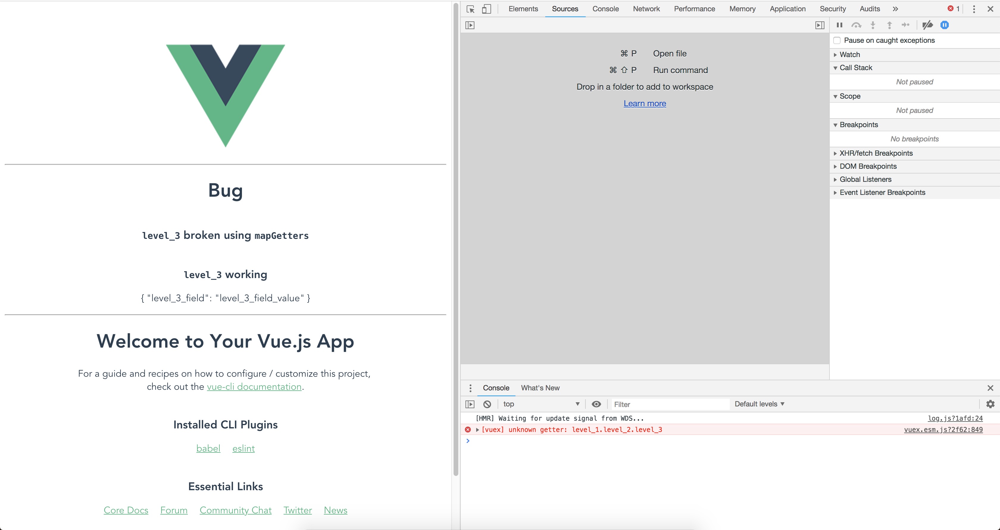

# `vue_js_vuex_accessing_nested_property_bug`
We should see the message `{ "level_3_field": "level_3_field_value" }` twice, however it
appears only once. Please see the screenshot.

When `state`, see [./src/store.js](./src/store.js), is defined:

```js
  state: {
    level_1: {
      level_2: {
        level_3: {
          level_3_field: 'level_3_field_value',
        },
      },
    },
  },
  getters: {
    level_1: (state) => state.level_1,
  },
```

And used as, see [./src/components/HelloWorld.vue](./src/components/HelloWorld.vue),
the `level_3_broken` does not work, but the `level_3_working` seems to work:

```js
  computed: {
    ...mapGetters({
      level_3_broken: 'level_1.level_2.level_3',
    }),
    level_3_working() {
      return this.$store.getters['level_1']['level_2'].level_3;
    },
  },
```

## reproduce
```sh
git clone git@github.com:banaio/vue_js_vuex_accessing_nested_property_bug.git
cd vue_js_vuex_accessing_nested_property_bug
yarn install
yarn serve
open http://localhost:8080/
```

## error
### log
```sh
vuex.esm.js?2f62:849 [vuex] unknown getter: level_1.level_2.level_3
```
### screenshot


---

## Project setup
```
yarn install
```

### Compiles and hot-reloads for development
```
yarn run serve
```

### Compiles and minifies for production
```
yarn run build
```

### Run your tests
```
yarn run test
```

### Lints and fixes files
```
yarn run lint
```
